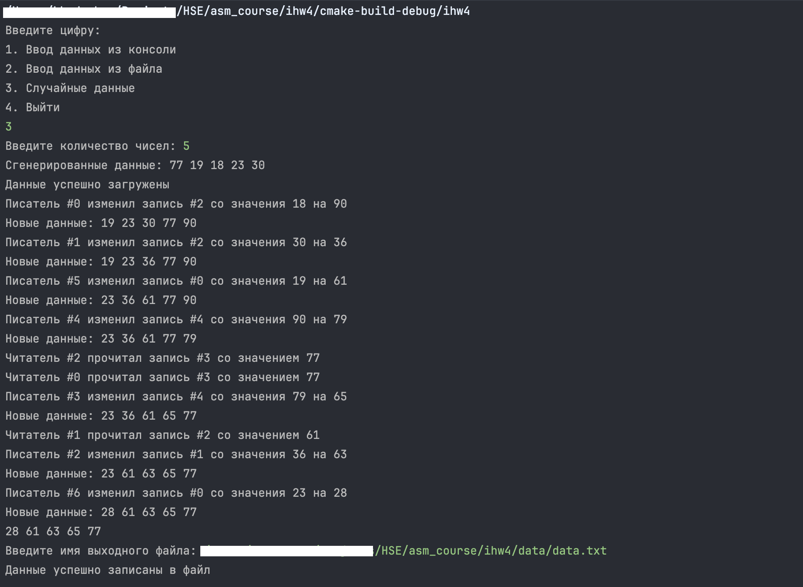

# ИДЗ №3
Автор: Николай Хадзакос, БПИ236
### Вариант №7
### Условие
Задача о читателях и писателях («подтвержденное чтение»). Базу
данных разделяют два типа процессов — читатели и писатели. Читатели периодически просматривают
случайные записи базы данных и выводя номер свой номер, 
индекс записи и ее значение. 
Писатели изменяют случайные записи на случайное число и также выводят информацию о своем номере, 
индексе записи, старом значении и новом значении. Предполагается, что в начале БД находится в
непротиворечивом состоянии (все числа отсортированы). Каждая
отдельная новая запись переводит БД из одного непротиворечивого состояния в другое (то есть, новая сортировка может поменять
индексы записей). Транзакции выполняются в режиме «подтвержденного чтения», 
то есть процесс-писатель не может получить доступ 
к БД в том случае, если ее занял другой процесс–писатель или
процесс–читатель. К БД может обратиться одновременно сколько
угодно процессов–читателей. Процесс читатель получает доступ к
БД, даже если ее уже занял процесс–писатель. Создать многопоточное приложение 
с потоками–писателями и потоками–читателями.

### Решение на 8 баллов
Язык программирования: С++
#### Сценарий работы сущностей
В заданной задаче читатели и писатели представляют собой процессы, которые одновременно взаимодействуют с общей базой данных. Читатели периодически обращаются к базе для просмотра случайной записи, не нарушая доступ других читателей, и фиксируют в логах свой номер, индекс записи и её значение.
В то же время писатели — это процессы, которые модифицируют данные, изменяя случайную запись на новое значение, после чего база пересортировывается для сохранения целостности.
Писатели работают поочерёдно, ожидая завершения работы текущего писателя или освобождения базы от всех читателей, что гарантирует согласованность данных.
Это можно представить как библиотеку, где одновременно могут читать книги множество людей (читатели). Каждый читатель выбирает случайную книгу, читает её содержимое и записывает в блокнот номер книги и важные заметки. Однако, если кто-то хочет внести изменения в содержание книги (писатель), он должен получить исключительный доступ, чтобы никто не мешал процессу редактирования. Во время редактирования книги читатели временно не могут брать её на прочтение, а другие писатели ждут своей очереди. Как только изменения завершены, книга возвращается на полку, и доступ к ней снова становится доступным для читателей. Такой порядок обеспечивает плавную работу библиотеки, где чтение и обновление информации происходят организованно и без конфликтов.

#### Модель параллельных вычислений
Для реализации задачи была использована модель взаимодействия потоков с синхронизацией через мьютексы и условные переменные. В программе создаются потоки для читателей и писателей, которые взаимодействуют с общими ресурсами — базой данных и логами. Потоки читателей и писателей синхронизированы между собой, чтобы избежать конфликтов при доступе к данным. Потоки писателей работают поочерёдно, а потоки читателей могут обращаться к базе данных одновременно, не блокируя друг друга.

#### Модель входных данных
Входные данные представляют с собой набор чисел, которые вводятся с консоли/файла/генерируются случайным образом. В программе реализован генератор случайных чисел, который заполняет базу данных случайными значениями. Пользователь может задать количество этих данных, если он хочет использовать свои значения. Количество читателей и писателей случайным образом генерируется в процессе выполнения программы.

#### Обобщенный алгоритм решения
Два мьютекса используются для управления доступом к базе данных и её состоянию, а условные переменные обеспечивают управление очередностью выполнения операций чтения и записи. Каждый поток-читатель перед доступом к базе захватывает мьютекс и проверяет, свободна ли база от писателей. Если писатели активны, поток ожидает через условную переменную. После получения доступа счётчик активных читателей увеличивается, что позволяет другим читателям также обращаться к базе параллельно. Завершив работу, поток-читатель уменьшает счётчик. Если счётчик активных читателей становится равен нулю, это означает, что база снова доступна для записи, и программа сигнализирует писателям.

Поток-писатель, в свою очередь, также захватывает мьютекс и ожидает освобождения базы, если есть активные читатели или другие писатели. Как только база становится доступной, поток получает эксклюзивный доступ, выполняет модификацию данных и сортирует массив для сохранения консистентности. Завершив запись, поток освобождает мьютекс, сбрасывает флаг активности и сигнализирует как читателям, так и другим писателям о доступности ресурса.

#### Структура программы
```
└── data - папка с функциями для работы с данными и самими данными
│   ├── input_data.cpp - опция ввода данных(консоль, файл, генерация)
│   ├── output_data.cpp - опция вывода данных(консоль и файл)
├── main.cpp - основной файл программы
├── CMakeLists.txt - файл для сборки проекта
├── README.md - отчет по заданию
```

#### Пример работы программы


#### Запуск программы через СMake
```
$ mkdir build
$ cd build
$ cmake ..
$ make
$ ./main
```

